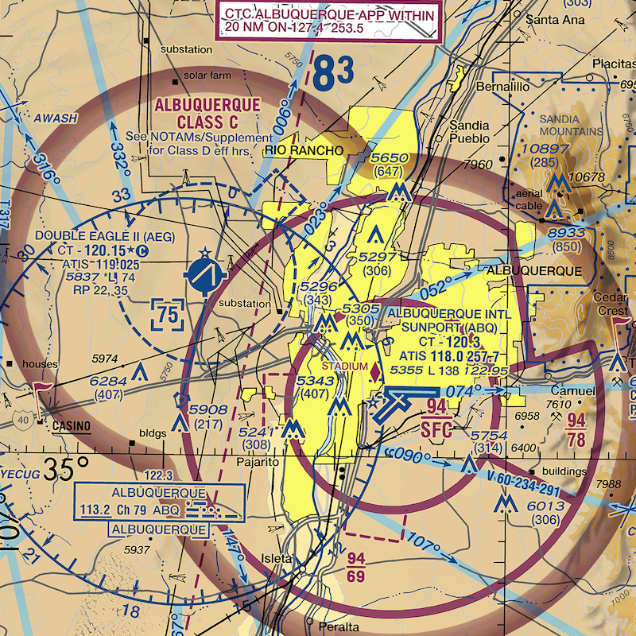
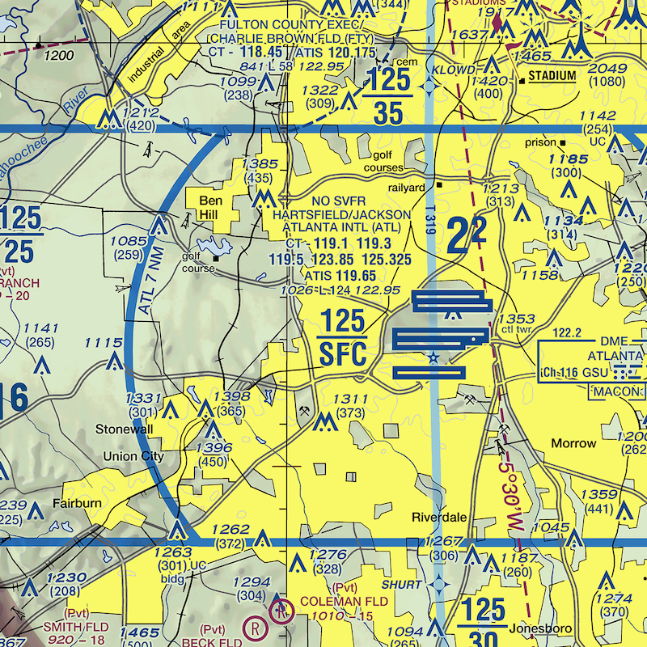
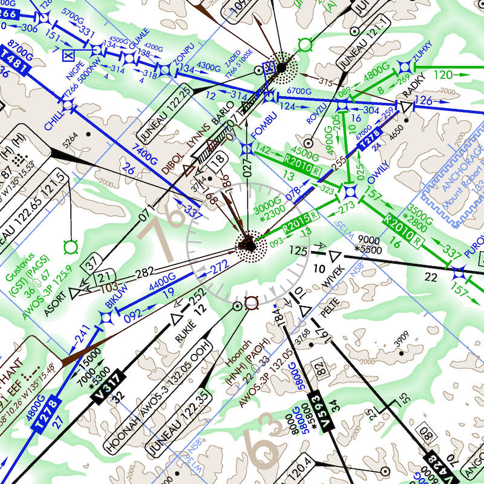
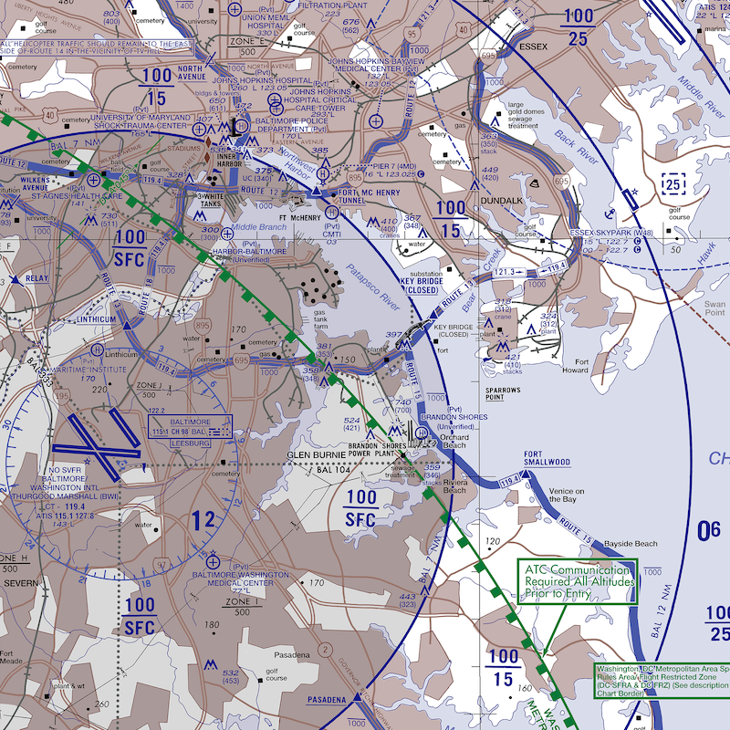

#  Aviation Chart Server

A Python service for processing and serving FAA aviation charts as tile pyramids.


*Aviation Chart Server processing and serving multiple chart types as interactive map tiles*

## What is the Aviation Chart Server?

The Aviation Chart Server is a comprehensive solution for downloading, processing, and serving Federal Aviation Administration (FAA) aeronautical charts as web-based tile pyramids. This service automatically manages the complete lifecycle of aviation charts, from download to serving, making them accessible through standard web mapping interfaces.

### Key Features:
- **Automatic Chart Updates**: Monitors FAA release schedules and automatically downloads new chart versions
- **Multi-Chart Support**: Processes Sectional, Terminal Area, IFR Enroute, and Helicopter charts
- **Tile Pyramid Generation**: Converts charts into zoomable tile pyramids for web mapping
- **Geospatial Processing**: Crops, reprojects, and optimizes charts using GDAL
- **RESTful API**: Serves charts through standard XYZ tile endpoints
- **Background Processing**: Handles chart updates without interrupting service

### Chart Types Supported:

#### Sectional Charts

VFR navigation charts covering large geographic areas with airspace, airports, and navigation aids.

#### Terminal Area Charts (TAC)

Detailed charts for complex airspace around major airports with high traffic density.

#### IFR Enroute Charts

Instrument flight rules charts showing airways, fixes, and navigation information.

#### Helicopter Charts

Low-altitude charts optimized for helicopter operations and navigation.

## Quick Start

After installing GDAL and the package, you can start the server:

```bash
# Start the server (default: localhost:8187)
aviation-chart-server

# Custom port and host
aviation-chart-server --port 3000 --host 0.0.0.0

# Test mode for a specific date
aviation-chart-server --test-date 12-26-2024
```

The server will start and be available at `http://localhost:8187` (or your specified port).

## Building the Package

For developers who want to build the package from source:

### Prerequisites
- Python 3.8 or higher
- `build` package: `pip install build`

### Build Commands
```bash
# Clean previous builds
rm -rf dist/ aviation_chart_server.egg-info/ build/

# Build both wheel and source distributions
python -m build

# Install locally for development
pip install -e .

# Or install the built wheel
pip install dist/aviation_chart_server-1.0.0-py3-none-any.whl
```

### Rebuilding After Changes
When you make changes to the code, especially if you modify:
- Source code files
- Configuration files
- Shape files in `aviation_chart_server/resources/`

You need to rebuild and reinstall:
```bash
# Clean and rebuild
rm -rf dist/ aviation_chart_server.egg-info/ build/
python -m build

# Force reinstall the updated package
pip install --force-reinstall dist/aviation_chart_server-1.0.0-py3-none-any.whl
```

## Installation

### Prerequisites: GDAL Installation

**This package requires GDAL to be installed first.** GDAL is a geospatial library used for processing aviation charts.

### macOS
The easiest way to install gdal for mac is Homebrew
```bash
brew install gdal
pip install aviation-chart-server
```


### Using Conda 

**Step 1: Install Miniconda**
Download and install Miniconda from: https://docs.conda.io/en/latest/miniconda.html

**Step 2: Install GDAL and the package**
```bash
# Create a new environment with GDAL
conda create -n aviation-charts -c conda-forge python gdal
conda activate aviation-charts

# Install the package
pip install aviation-chart-server
```

**Alternative: If you already have conda**
```bash
# Just install GDAL in your current environment
conda install -c conda-forge gdal
pip install aviation-chart-server
```

**For development: Using environment file**
```bash
# Clone or download the repository first
conda env create -f environment.yml
conda activate aviation-charts
```

### Alternative: System GDAL Installation

**Ubuntu/Debian:**
```bash
sudo apt-get install gdal-bin libgdal-dev python3-gdal
pip install aviation-chart-server
```

**CentOS/RHEL:**
```bash
sudo yum install gdal-devel python3-gdal
pip install aviation-chart-server
```

**Windows:**
For Windows, we strongly recommend using conda as system GDAL installation is complex. If you must use system GDAL:
1. Download GDAL from: https://gdal.org/download.html#windows
2. Install OSGeo4W or use pre-compiled binaries
3. Add GDAL to your PATH
4. Run: `pip install aviation-chart-server`

## Objective
At the time when this service was created, there were no service available that would let us serve aeronautical charts as a tile pyramid. 
In the past a service called "Chartbundle" was used, but when it stopped working there was a need to create our own.
The VFR Chart Processing Service checks daily if the charts are due to update, and they are, a script will start downloading, and processing scripts.
The service combines individual charts into one raster and serves them as tile pyramid that allows zoom functionality.

## Chart update schedule 

FAA publishes their digital aeronautical charts every 28/56 days.
The schedule can be found here: https://www.faa.gov/air_traffic/flight_info/aeronav/productcatalog/doles/

The schedule is stored under the update_schedule key in the JSON config file - chart_service_config_json. It consists of a list of years, each containing an array of release dates in MM-DD-YYYY format:

```
"update_schedule": [
  {
    "year": 2024,
    "dates": ["12-26-2024"]
  },
  {
    "year": 2025,
    "dates": ["02-20-2025", "04-17-2025", ... ]
  }
]
```

### Automatic Update Behavior

When the chart server starts, it checks if today’s date matches one of the scheduled update dates.
If a match is found, it runs chartProcessor.py to download and process the updated charts.
If the charts/ directory or its required subdirectories are missing on startup, the server automatically performs a fresh download using the closest available release date.
The system (chartServer.py) also runs a background thread that checks for updates nightly at midnight (00:00) and performs processing if needed.

###  Manual Testing of Updates

To manually trigger the update logic for a specific date (e.g., for testing purposes), use the --test-date argument when launching the server:
```
python3 chartServer.py --test-date 12-26-2024
```

### Forcing a Fresh Download

To trigger a full download and processing of charts as if the system was starting fresh:
1. Delete the existing charts/ folder located at services/chart_processor/charts/

2. Restart webserver:
```
python3 chartServer.py
```

## Chart Download Pipeline
The chart processing system downloads raster-based FAA charts for various chart types (Sectional, Terminal Area, IFR Enroute, Helicopter) based on a fixed update schedule.
Each update cycle involves retrieving .zip files containing .tif rasters, extracting them, processing the data (cropping, reprojecting, tiling), and finally storing them in a tile pyramid format suitable for web map viewing.

The chart files and download locations are configured in: services/chart_processor/chart_service_config.json
Each chart type has:

A base_url where .zip files containing .tif rasters can be downloaded.
A list of areas that identifies all expected .zip filenames to download for that chart type.
A dynamic {date} placeholder in the URL, replaced at runtime with the current chart release date.
Example (for Sectional charts):
```
"SECTIONAL": {
"base_url": "https://aeronav.faa.gov/visual/{date}/sectional-files/",
"areas": ["Albuquerque", "Anchorage", "Atlanta", ...]
}
```

This configuration tells the system to download files such as:
https://aeronav.faa.gov/visual/12-26-2024/sectional-files/Anchorage.zip


### Download process
The process for downloading and extracting TIFs is handled within the chartProcessor.py script:

For each area in the chart type configuration:
A .zip archive is downloaded.
The archive is extracted to a temporary directory.
All .tif files inside the archive are renamed (as needed) and moved to the processing directory.
Sectional and IFR charts are matched to corresponding shapefiles for cropping.
The script distinguishes between:

download_and_extract_tifs() — Used for SECTIONAL, IFR ENROUTE LOW, HIGH, and HELICOPTER charts.
download_terminal_area_set() — Used for TERMINAL_AREA_SET to extract all TAC charts in bulk.

### Download Triggers
There are three ways the system triggers a chart download:

1. Automatic (Nightly)	The chart server checks at midnight each day to see if today is a scheduled chart update date. If so, it triggers a download.
2. Startup Check	When the chart server starts and required subfolders under charts/ are missing, it performs a fresh download using the closest prior date from the schedule.
3. Manual Test Mode	You can run the processor manually for a specific date: 
```
python3 chartServer.py --test-date 12-26-2024
```


## Tif file processing pipeline

Once .tif chart files are downloaded from the FAA servers, the system performs a sequence of processing steps to prepare the data for use in a tile-based web map interface. The pipeline is optimized for both visual clarity and efficient rendering in GIS applications.

The processing workflow is tailored per chart type, but generally includes the following stages:

### Cropping
   Applies to all but Terminal Area Charts, since they are sparsely located and rarely overlap.

Each .tif raster is cropped to its corresponding geographic boundary using a .shp file (shapefile) found in:
services/chart_processor/shape_files/<chart_type>/
This step is needed because tif file include legend around the actual map, and if we combine several charts into one, the legend sections overlap neighboring sections.

### Shape file definition
The shape files were manually created using an open-source tool https://qgis.org
If a new shape file needs to be added, open a tif file in QGIS, crate shapefile layer, and define the polygon of interest.
Note, when we create a shapefile in a folder, supportive files are also created(.cpg, .dbf, .prj, .shx). They are all required.
Newly created shape files (in folders) need to be placed in the shape_files folder.

The shapefile folder needs to be named the same way as a correspondent tif file.

## Logs
Two log files track system behavior.
chart_processor.log: Tracks chart download, processing, and tile generation activity.
chart_server.log: Tracks server activity and update checks.
Both logs are located in the services/chart_processor/ directory and rotate automatically when they exceed 10 MB.


# Dependencies
You will need to install gdalwarp command-line tool used for geospatial transformation. Unfortunately, gdalwarp cn not be installed using pip.

To install gdalwarp run:
On macOS: 
```
brew install gdal
```
On Linux:
```
sudo apt-get install gdal-bin
```
On Windows: Download from https://www.gisinternals.com/ or install via OSGeo4W

The system will install other python dependency using requirement.txt file

## Script Start
The script automatically starts when the WebServer.java is launched.

## Zoom level

To change the Zoom leve in tile pyramid, locate generate_tiles method in chartProcessor.py
Change zoom level defined here: --zoom=0-11
Note, larger zoom level will increase quality of image when we try to zoom in, but it may take significantly more time to create a pyramid.

```
command = [
"gdal2tiles.py",
"--zoom=0-11",
virtual_raster_path,
tiles_output_path
]

```

## Consuming tiles:
Currently, host/port for chart service are configured for "localhost: 8187 ".
Host/port configuration can be changed in: chart_service_config.json You will also need to change host/port in src/main/javascript/map.js
E.g:   http://localhost:8187/terminal-area/{z}/{x}/{-y}.png
****